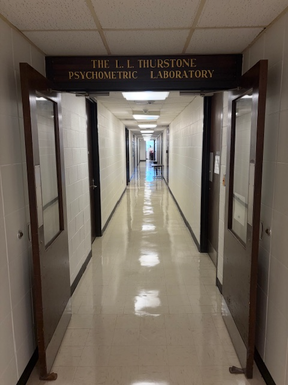
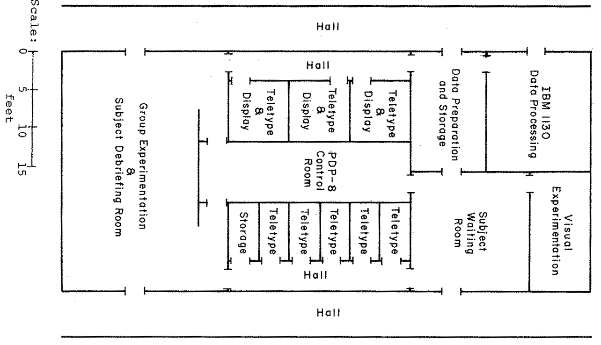
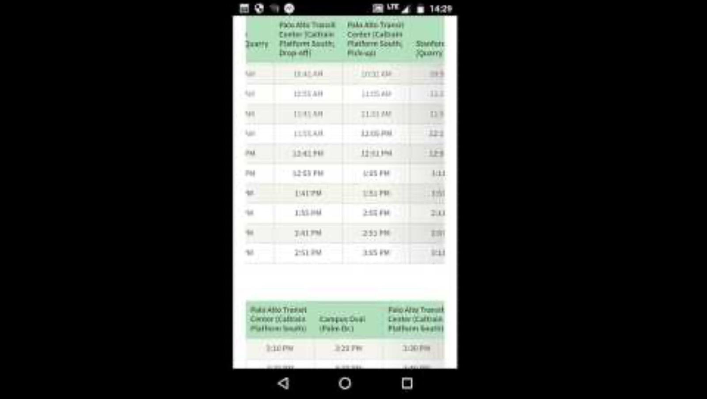
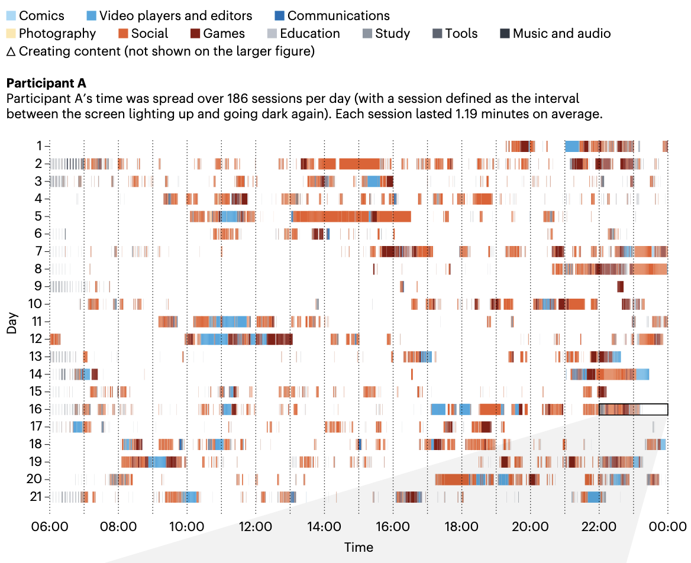
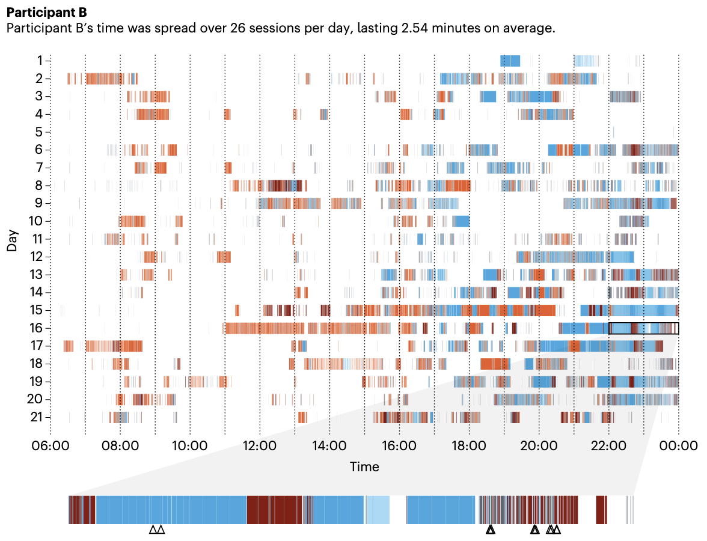

::: {style="color: yellow"}
## Welcome
:::

Welcome to Applied Machine Learning in Psychology. This page covers our first meeting: why psychology and machine learning belong in the same sentence, what "big data" actually means for behavioral scientists, and how this course will run.

::: {style="color: yellow"}
## The Long History of Big Data in Psychology
:::

- It is tempting to think of "big data" as a recent arrival, but in psychology big data has been around since the earliest years of the field. 
- Even by the late 1800s, psychologists were collecting "massive and often unmanageable" amounts of data via standardized questionnaires (Young, 2018).
- Large amounts of data presented new problems and interesting opportunities for research scientists, and those struggles often catalyzed methodological development.

::: {style="color: yellow"}
### Questionnaire Research
:::

G. Stanley Hall began questionnaire research in 1882 hoping to understand "the contents of children's minds." 

- Between 1894 and 1915, Hall circulated more than 200 different questionnaires
- Topics ranged from anger to dolls to "the early sense of self" 
- Hall hoped to produce "a composite photograph" of each construct 
- By 1896 over one hundred thousand questionnaires had been returned

> When these returns come in, one at first feels helpless before them. We have now at least a hundred thousand returns, some of them comprising forty and fifty pages of manuscript. Statistical methods have been used, and the very best trained statisticians have to be employed, and we have no money for these. We have kept four people at work off and on for nearly a year. (Hall, 1897, quoted in Young, 2018)

::: {style="color: yellow"}
### Thurstone and Likert
:::

The use of questionnaires and surveys only grew during the First World War, when psychologists faced data collection at military scale. As Young (2018) recounts:

> A concerted effort was made to assess the intellectual capacities of army recruits (Carson, 2007). Faced with the challenges of the mass testing of millions of recruits, psychologists opted to use intelligence tests with restricted answer sets and set about analyzing the abundant data with new statistical techniques. These innovations informed Thurstone and Likert in their creation of scaled questionnaires, including the latter's eponymous and now ubiquitous Likert scale (Likert, 1932; see Young, 2017).

**In other words, one of the most familiar tools in all of psychology, the Likert scale, was itself born from a big data problem.**

The shift came at a cost, though. Young (2018) describes it as a move from *thick* description to *thin*: flattening a person's experience to a number on a scale made mass data easy to refine, combine, and plot, but the individual all but disappeared into the aggregate. Psychology has been navigating that trade-off between rich, messy description and manageable, aggregable numbers ever since.

::: {.callout-note icon="false"}
## Further Information

Decades later, Peter Molenaar showed that the individual's disappearance into the aggregate is not just a descriptive loss but a mathematical problem. His "manifesto" (Molenaar, 2004) argued that findings from aggregated data, which describe differences *between* people, only transfer to the processes unfolding *within* a person under restrictive conditions (i.e. ergodicity) that psychological processes rarely satisfy. A structure discovered in the aggregate may describe no actual individual at all. Molenaar's call to bring "the person back into scientific psychology" through person-specific analysis of intensive time series helped motivate the modern wave of intensive longitudinal data collection.

*Molenaar, P. C. M. (2004). A manifesto on psychology as idiographic science: Bringing the person back into scientific psychology, this time forever. Measurement: Interdisciplinary Research and Perspectives, 2(4), 201-218.* [https://doi.org/10.1207/s15366359mea0204_1](https://doi.org/10.1207/s15366359mea0204_1)
:::

::: {style="color: yellow"}
### L. L. Thurstone Psychometric Laboratory
:::

Actually, the big data story runs through the very building you are sitting in... 

{fig-align="center"}

L. L. Thurstone spent his final years at UNC, moving here from Chicago in 1952, and the university's Psychometric Laboratory still bears his name.

**In 1959 the lab acquired the first computer at UNC**, a Royal McBee LGP-30. It was the first of a series of installations that made the Lab "one of the few places in the world where computers were used for psychological data collection and statistical analysis in the 1960s" (Thissen, 2016).

{fig-align="center"}

Below is Davie Hall around 1967, shortly after it opened, along with a floor plan of the Lab's computer-based facilities on its third floor, the same floor as our classroom: an IBM 1130 for data processing, a PDP-8 minicomputer running banks of teletype and display stations, and dedicated rooms for waiting, testing, and debriefing participants. 

Psychologists were building big data pipelines in this very building for half a century before data science as a field existed.

{fig-align="center"}

{fig-align="center"}

*Jones, L. V., Johnson, E. S., & Young, F. W. (1973). Computer control of experiments in problem solving, psychophysics, and decision making. In B. Weiss (Ed.), Digital computers in the behavior laboratory (pp. 309-340). New York: Appleton-Century-Crofts.*

*Thissen, D. (2016). Remembering Lyle V. Jones (1924-2016). Psychometrika, 81(3), 904-905.* [https://doi.org/10.1007/s11336-016-9510-4](https://doi.org/10.1007/s11336-016-9510-4)

::: {style="color: yellow"}
### Modern Big Data in Psychology
:::

Today, large and complex datasets appear across nearly every corner of the field, including research on:

-   wellness, mental health, and depression
-   substance use and behavioral health
-   behavior change
-   social media
-   workplace well-being and effectiveness
-   student learning and adjustment
-   behavioral genetics

*Young, J. L. (2018). The long history of big data in psychology. The American Journal of Psychology, 131(4), 477-482.* [https://doi.org/10.5406/amerjpsyc.131.4.0477](https://doi.org/10.5406/amerjpsyc.131.4.0477)

::: {style="color: yellow"}
## But What Is "Big Data"?
:::

"Big Data" is a buzzword in academia and industry, but its meaning is shrouded in conceptual vagueness. 

The term gets used to describe everything from the technological ability to store, aggregate, and process data to the sheer excess of information available in daily life.

De Mauro et al. (2015) reviewed the many competing definitions and identified four key themes:

1.  **Information**: the raw material itself
2.  **Technology**: the storage and computing power to handle it
3.  **Methods**: the analytic techniques it demands
4.  **Impact**: its effects on science and society

Two of these themes matter most for this course.

::: {style="color: lightblue"}
### Information
:::

A few useful terms for thinking about where all this data comes from:

-   **Digitization**: converting continuous, analog information into a discrete, machine-readable format
-   **Datafication**: putting a phenomenon in a quantified format so it can be tabulated and analyzed
-   **Structured data**: traditional text and numeric information, arranged in rows and columns
-   **Unstructured data**: social media feeds, conversations, images, and other formats that don't arrive as a tidy table

::: {style="color: lightblue"}
### Methods
:::

Analyzing data at this scale pushes us beyond traditional statistical techniques in several ways: a shift away from explanation towards prediction, machine learning techniques (both **supervised** and **unsupervised**, terms we will define on Thursday), and methods that protect against false discovery, that is, seeing patterns where none exist simply because we have enormous quantities of data.

*De Mauro, A., Greco, M., & Grimaldi, M. (2015). What is big data? A consensual definition and a review of key research topics. AIP Conference Proceedings, 1644(1), 97-104.*

::: {.callout-tip icon="false"}
## Discussion

In small groups of 3-4, come up with an example of "big data" in the social, health, or behavioral sciences, and discuss why each qualifies. Then consider: what is different about the data we see in psychological research compared to typical big data applications? Think about measurement, heterogeneity across people, and any other themes that come to mind.
:::

::: {style="color: yellow"}
## An Example: The Human Screenome Project
:::

To make this concrete, consider the [Human Screenome Project](https://screenomics.stanford.edu) (Reeves, Robinson, & Ram, 2020). 

Instead of asking people to estimate their "screen time," researchers record moment-by-moment changes on a person's screens: a screenshot every 5 seconds, compressed and encrypted on the device, for many months at a time. 

The result is what they call a *screenome*, by analogy to the genome: a high-resolution record of a person's digital life. The project has collected over 30 million screenshots from more than 600 people. To get a feel for what a screenome actually looks like, [watch this sample video](https://screenomics.stanford.edu/wp-content/uploads/2024/11/ScreenomeSampleforPublic_2020_0127.mp4) from the project: a real stretch of one person's screen life, played back frame by frame.

Each captured frame is an ordinary moment of phone use, like this one:

{fig-align="center"}

Why does this level of detail matter? Consider two 14-year-olds living in the same northern California community. By a conventional "screen time" measure they are nearly identical, but the screenome tells a different story:

-   **Dose**: A uses their phone 3.67 hours per week; B uses 4.68
-   **Pattern**: A's use is spread over 186 sessions per day of about 1.2 minutes each; B has 26 longer sessions of about 2.5 minutes
-   **Interactivity**: A creates content in 2.6% of frames; B in 7%
-   **Content**: 53% of A's use is social media; 37% of B's is food-related

{fig-align="center"}

{fig-align="center"}

A single summary number (e.g. "about 4 hours per week") would treat these two adolescents as the same. 

The patterns that plausibly matter for their well-being live in the structure that the summary throws away. 

This is the century-old tension from Young's history returning with the polarity reversed.

Data like this is why this course exists: it is rich, complex, far beyond what a t-test was built for, and the question of what to do with it is exactly where machine learning enters.

*Reeves, B., Robinson, T., & Ram, N. (2020). Time for the human screenome project. Nature, 577(7790), 314-317.*

::: {.callout-tip icon="false"}
## Discussion

What types of questions would you ask if you had access to the human screenome data? Are there any difficulties you foresee in analyzing this type of data? "Big data" is often described as the motivation for machine learning techniques. Why is that?
:::

::: {style="color: yellow"}
## About This Course
:::

### This course is ...

-   **Inherently a statistics course.** We focus on what each algorithm does and how to carry it out, with plenty of discussion of broader data science issues along the way.
-   **An introductory course.** For every method we cover, there are many venues to learn more.
-   **Partly a programming course.** We will carry out all of our analyses using the R statistical platform, and no prior coding experience is assumed.
-   **A psychology course.** We will keep applications in psychology and neighboring behavioral sciences in view throughout.

### Goals

By the end of the semester you should be able to:

1.  Differentiate between explanatory and predictive approaches to data analysis.
2.  Competently use R to fit, diagnose, evaluate, and interpret machine learning algorithms.
3.  Communicate effectively, in writing and verbally, what machine learning algorithms are doing and when to use them.

### How You Will Be Evaluated

-   **Participation (10%)**: in-class activities, discussions, and group exercises.
-   **In-class exercises (30%)**: up to six structured coding exercises completed and submitted during class; your lowest grade is dropped.
-   **Lab reports (30%)**: three reports covering regression methods, tree-based methods, and clustering approaches.
-   **Final project (30%)**: a flash talk proposing your idea, a final presentation, and a written paper.

### Readings

The primary texts are Boehmke & Greenwell's *Hands-On Machine Learning with R* (**BG**) and James et al.'s *An Introduction to Statistical Learning* (**ISL**). Both are freely available online. Supplemental readings will be posted as PDFs on Canvas.

### The Road Ahead

The course has three major parts, mirroring the syllabus modules:

1.  **Foundations of Machine Learning** (mid-August through early September): core concepts, R, and the modeling pipeline
2.  **Supervised Learning** (September through mid-October): regression methods, trees and ensembles, deep learning, and interpretability
3.  **Unsupervised Learning** (late October through November): clustering and dimension reduction

The complete schedule, policies, and grading details live in the syllabus on [Canvas](https://canvas.unc.edu/).

::: {.callout-note icon="false"}
## Reading for Thursday

Before our next class, read Yarkoni & Westfall (2017), available as a PDF on Canvas. It makes the case that psychology has much to gain from taking prediction seriously, and it frames Thursday's discussion of explanatory versus predictive approaches to data analysis. As you read, keep one question in mind: does making good predictions require understanding how a process works?

*Yarkoni, T., & Westfall, J. (2017). Choosing prediction over explanation in psychology: Lessons from machine learning. Perspectives on Psychological Science, 12(6), 1100-1122.* [https://doi.org/10.1177/1745691617693393](https://doi.org/10.1177/1745691617693393)
:::
