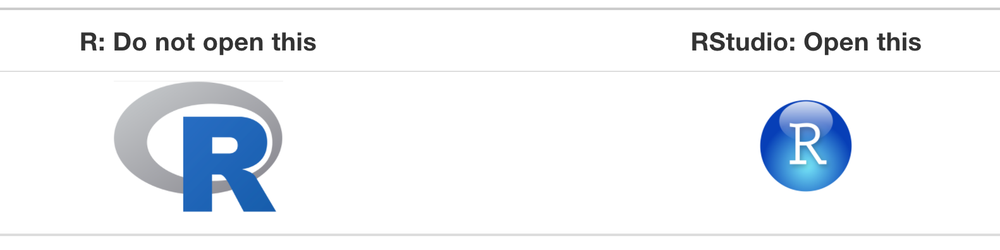
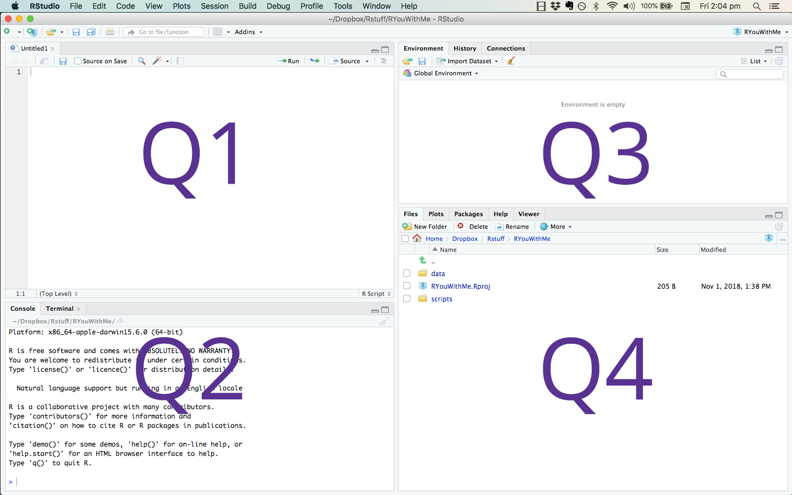
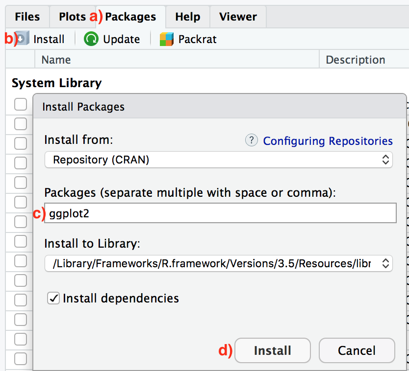
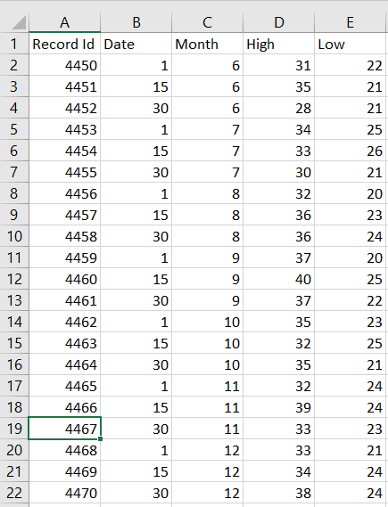

::: {style="color: yellow"}
## Basic R Programming
:::


::: {style="color: lightblue"}
### Setting Up Your Environment
:::

Before getting started we will need to install R and RStudio.

#### Installing R

We can download R from CRAN, the **c**omprehensive **R** **a**rchive **n**etwork. CRAN is a server used to distribute R and R packages. If you don't have R installed already you can do so [here](https://cloud.r-project.org).

#### Installing RStudio

With R installed, let's go ahead and install RStudio. RStudio is a convenient IDE (integrated development environment) for R programming. [Download](https://posit.co/downloads/) and install the RStudio Desktop client.

#### Helpful Links

*From the [RStudio Education](https://education.rstudio.com/learn/beginner/) page*:

> For beginner-friendly installation instructions, we recommend the free online ModernDive chapter [*Getting Started with R and RStudio*](https://moderndive.netlify.com/1-getting-started.html). You may also enjoy the [*Basic Basics*](https://rladiessydney.org/courses/ryouwithme/basicbasics) lesson unit from [R-Ladies Sydney](https://rladiessydney.org), which provides an [opinionated tour of RStudio](https://rladiessydney.org/courses/ryouwithme/01-basicbasics-1/) for new users and a [step-by-step guide to installing and using R packages](https://rladiessydney.org/courses/ryouwithme/01-basicbasics-2/).

#### Difference between R and RStudio

For those of you who may be unfamiliar with using an IDE, RStudio is simply a convenient way for us to interact with R. You can think of R as the engine, powering the car, and RStudio as the controls and dashboard for driving. For 559, we won't interact directly with R very often, instead we will work with R directly from RStudio.

{fig-align="center"}

#### Interacting with RStudio

After opening RStudio you will see something similar to the image below, where the application is divided into different *panes*. Each pane serves a different purpose:

-   **Q1**: contains scripts you are working from and sometimes data views

-   **Q2**: the console where you run the code

-   **Q3**: the environment page, code history, and build tools

-   **Q4**: files, plots, packages, help documentation

{fig-align="center"}

#### Coding in RStudio

Let's begin by using the Console to interact with R.

##### Using R as a Calculator

We can use R as a basic calculator.

```{r}
#| label: r_as_calculator
#| eval: false
#| include: true
1 / 200 * 30
#> [1] 0.15
(59 + 73 + 2) / 3
#> [1] 44.66667
sin(pi / 2)
#> [1] 1
```

##### Creating New Objects

We can create new object using the assignment operator `<-` as follows:

```{r}
x <- 3 * 4
secret_password <- "password1234"
```

In R, object names are case sensitive, must start with a letter and can contain numbers, letters, underscores and periods.

You can look at objects by typing their name into the console:

```{r}
x
```

```{r}
secret_password
```

If you type an object that hasn't been defined yet you will get an error. For example,

```{r}
#| error: true
Secret_Password
```

##### Calling Functions in R

R has many built-in functions and you can also create your own. Functions can be used to perform tasks in R. They take *arguments* as inputs, and return *outputs*. Often you will supply arguments to a function, and it is also possible to use a function’s default values.

For example, there is a function in R called `seq(from, to)` that creates a sequence of numbers starting at `from` and ending at `to`. For example, if we want a sequences of numbers `from = 10` all the way `to = 20`:

```{r}
# you can add comments to your code using the # key
# anything after the # will not be run as code
# note the code below is equivalent to seq(10, 20)

seq(from = 10, to = 20) 
```

If you want to better understand what a specific function in R does you can always look to the documentation by typing a question mark before the function name in the R console, for example `?seq` or `?rep`.

```{r}
?seq
```

##### Adding Comments to Your Code

It is good practice to add comments to your code. These comments can help others understand what you are doing, and more importantly, they will help you remember what you did. How to effectively use comments is part of a larger discussion on how to write effective and understandable code, and if you're interested take a look at different [style guides for R](http://adv-r.had.co.nz/Style.html).

```{r}
# you can add comments to your code using the # key 
# anything after the # will not be run as code 
#
# note: the code below is equivalent to seq(10, 20)

seq(from = 10, to = 20)
```

##### Common Data Types in R

Four of the most common data types used in R are discussed below:

-   **Numeric**: The most common data type in R is numeric. A variable or a series will be stored as numeric data if the values are numbers or if the values contains decimals. For example, the following two series are stored as numeric by default:

    ```{r}
    # numeric series without decimals
    num_data <- c(3, 7, 2)
    num_data
    class(num_data)

    # numeric series with decimals
    num_data_dec <- c(3.4, 7.1, 2.9)
    num_data_dec
    class(num_data_dec)
    ```

-   **Character**: The data type character is used when storing text, known as strings in R. The simplest ways to store data under the character format is by using `""` around the piece of text:

    ```{r}
    char <- "some text"
    char
    class(char)
    ```

-   **Factor**: Factor variables are a special case of character variables in the sense that it also contains text. However, factor variables are used when there are a limited number of unique character strings. It often represents a categorical variable.

    ```{r}
    text <- c("test1", "test2", "test1", "test1") # create a character vector
    class(text) # to know the class
    text_factor <- as.factor(text) # transform to factor
    class(text_factor) # recheck the class
    ```

-   **Logical**: A logical variable is a variable with only two values; `TRUE` or `FALSE`

    ```{r}
    value1 <- 7
    value2 <- 9

    # is value1 greater than value2?
    greater <- value1 > value2
    greater
    class(greater)
    ```

These are four common R data types you'll see in this class. There are others not listed here. For more detailed descriptions of data types in R there are a number of helpful resources available online, including this discussion of [data structures](https://resbaz.github.io/2014-r-materials/lessons/01-intro_r/data-structures.html).

##### Making Decisions with `ifelse()`

Often we want R to choose between two values based on a condition, such as labeling cases as "high" or "low" on some variable. The `ifelse()` function does this for an *entire vector at once*, following the pattern `ifelse(condition, value_if_true, value_if_false)`:

```{r}
scores <- c(12, 31, 25, 8, 19)

ifelse(scores > 20, "high", "low")
```

Each element is checked against the condition and replaced with the appropriate label. This vectorized style is how we'll create binary features and recode variables all semester, so it's worth internalizing now.

`ifelse()` also works with numbers. For example, converting scores to a 0/1 indicator:

```{r}
ifelse(scores > 20, 1, 0)
```

*A related tool you may know from other languages:* R also has `if (condition) { ... } else { ... }` blocks, which choose between two *chunks of code* rather than two values, and operate on a single condition rather than a whole vector. We'll see them occasionally, but in data analysis `ifelse()` is the one you'll reach for constantly.

```{r}
x <- 3

if (x > 6) {
  print("x is greater than 6")
} else {
  print("x is less than or equal to 6")
}
```


::: {style="color: yellow"}
## R Packages
:::


::: {style="color: lightblue"}
### Installing R Packages
:::

One of the main reasons to be excited about R is the package library system. In R, packages are like apps. R packages extend the functionality of base R by providing additional functions, data, and documentation. They are written by a worldwide community of R users and can be downloaded freely without much hassle (compared to many other package libraries). For example, we will often use the `ggplot2` package for plotting and visualizing data and the `psych` package for describing data numerically.

To install R packages you can use the `install.packages()` function directly in the console as follows:

```{r, eval=FALSE}
install.packages("ggplot2")
```

or you can do so from the Packages tab of the Files pane in RStudio using the following steps:

1.  Click on the “Packages” tab.

2.  Click on “Install” next to Update.

3.  Type the name of the package under “Packages (separate multiple with space or comma):” In this case, type `ggplot2`.

4.  Click “Install.”

{fig-align="center"}

::: {style="color: lightblue"}
### Using R Packages
:::

Once a package is installed you can load it into your environment using the `library()` function. Once loaded you have access to all the R functions supplied by that package.

```{r}
library("ggplot2")
```

::: {style="color: lightblue"}
### Finding Useful R Packages
:::

There are many ways to find useful R packages on the internet simply by googling the type of data or analysis you are interested in. Another way is to look at the [CRAN Task Views](https://cran.r-project.org/web/views/). For example, there is an interesting [Task View for Machine Learning](https://cran.r-project.org/web/views/MachineLearning.html) that contains many relevant packages you might be interested in using. Some class members expressed interest in F1 racing. In the S[ports Analytics Task View](https://cran.r-project.org/web/views/SportsAnalytics.html) there is a [`f1dataR`](https://cran.r-project.org/web/packages/f1dataR/index.html) package that provides historical data from the beginning of Formula 1.


::: {style="color: yellow"}
## Reading in Data
:::


::: {style="color: lightblue"}
### Loading Data
:::

One of the most important initial tasks you'll face in R is reading in data. Let's walk through some basics.

By reading in data we are generally referring to the process of importing data from a local directory on your computer, or from the web, into R. When we read a data file into R, we often read it in as a tabular object where columns represent variables and rows represent cases. This is not always the case but covers the most basic use case.



Many different data file formats can be read into R as data frames, such as .csv (comma separated values), .xlsx (Excel workbook), .txt (text), .sas7bdat (SAS), and .sav (SPSS) can be read into R. We will mostly focus on the .csv case in this class.

::: callout-tip
### Download the Data

The examples in this section use a marketing dataset. Download it here: [ifood_df.csv](data/ifood_df.csv) (right-click → "Save Link As..." if it opens in your browser). Save it in the same folder where you keep your R scripts for this class.
:::

#### Where Is Your Data File? Paths in R

To read a file into R, R needs to know where the file lives on your computer. The most explicit way to say so is a **full path**: the complete address of the file, starting from the root of your hard drive. For example, on my computer the path to the marketing data looks like this:

```{r, eval=FALSE}
df <- read.csv("/Users/zacharyfisher/Dropbox/GitHub/proj_559/PSYC559-Site/data/ifood_df.csv")
```

Your path will look different, since it depends on your username, operating system, and where you saved the file. A convenient way to find a file's full path is with `file.choose()`, which opens a file picker and prints the path of whatever you select:

```{r, eval=FALSE}
file.choose()
```

#### A Better Habit: Keep Data Next to Your Script

Full paths work, but they are fragile: the code breaks the moment a folder gets moved or renamed, and it can never run on anyone else's computer (including mine, when I am trying to help you debug or grade your work).

The habit we will use in this class: **keep your data file in the same folder as the script (or R Markdown document) that uses it**, and refer to the file by name:

```{r}
df <- read.csv("data/ifood_df.csv")
```

This is called a **relative path**: R looks for the file relative to where it is currently working. When you knit an R Markdown document, R automatically works from the folder where the `.Rmd` file lives, so if the data sits next to your document (or in a `data/` subfolder, as above), everything just works on your machine, on your groupmate's, and on mine.

If you are working in a plain R script and R can't find your file, check where R is currently looking with:

```{r, eval=FALSE}
getwd()
```

and make sure your data is in that folder (or open your script through RStudio's **File** menu, which usually sets things up correctly).

#### Looking at the Data

Once the .csv file is loaded you can look at it using the `View()` function

```{r, eval=FALSE}
View(df)
```

or simply examine the first few cases using `head()`

```{r}
head(df)
```


::: {style="color: yellow"}
## Working with Data Frames
:::


::: {style="color: lightblue"}
### Data Frames
:::

Nearly everything we do this semester will start with a data frame: a rectangular table where each row is a case (a person, a customer, a house) and each column is a variable. In this section we'll practice pulling pieces out of a data frame, creating new variables, and chaining operations together. These are the skills you'll use in every single lab and assignment.

Let's read in the marketing data we saw previously (download: [ifood_df.csv](data/ifood_df.csv)).

```{r}
df <- read.csv("data/ifood_df.csv")
```

A few functions are useful for getting oriented whenever you load a new dataset:

```{r}
dim(df)      # number of rows and columns
nrow(df)     # number of rows (cases)
names(df)    # variable names
```

```{r}
head(df[, 1:6])  # first few rows of the first 6 columns
```

::: {style="color: lightblue"}
### Selecting a Variable with `$`
:::

The `$` operator pulls a single variable out of a data frame as a vector. This is one of the most common operations in R, and you will see it constantly in this course.

```{r}
mean(df$Income)    # average household income
table(df$Complain) # how many customers lodged a complaint?
```

We can also use `$` to create a new variable in the data frame. For example, the number of children at home is split across two variables, `Kidhome` and `Teenhome`. Let's combine them:

```{r}
df$TotalKids <- df$Kidhome + df$Teenhome
table(df$TotalKids)
```

::: {style="color: lightblue"}
### Subsetting with `[rows, columns]`
:::

Square brackets let us take a subset of a data frame using the pattern `df[rows, columns]`. Leaving either slot empty means "keep everything."

```{r}
df[1:5, ]                        # first five rows, all columns
head(df[, c("Income", "Age")])   # all rows, two named columns
```

We can also select rows using a logical condition. For example, customers with incomes above \$75,000:

```{r}
high_income <- df[df$Income > 75000, ]
nrow(high_income)
```

Read that as: "keep the rows of `df` where `df$Income > 75000` is `TRUE`, and all columns."

::: {style="color: lightblue"}
### Missing Values: `NA`
:::

Real data is rarely complete. R represents a missing value with `NA` ("not available"), and `NA` behaves differently than you might expect: most computations involving a missing value return a missing value.

```{r}
x <- c(4, 7, NA, 2)
mean(x)
```

That `NA` answer is R being honest: it can't know the mean of numbers it doesn't have. If you've decided that ignoring the missing values is appropriate, say so explicitly with `na.rm = TRUE`:

```{r}
mean(x, na.rm = TRUE)
```

To find missing values, use `is.na()`. Asking `x == NA` does *not* work, because comparing anything to an unknown is also unknown:

```{r}
is.na(x)        # which entries are missing?
sum(is.na(x))   # how many are missing?
```

For a whole data frame, `colSums(is.na(df))` shows the missing count per variable. Our marketing data happens to be a cleaned dataset:

```{r}
sum(is.na(df))  # no missing values here
```

Real psychological data will rarely be this kind; the General Social Survey data in your first assignment certainly won't be. Handling missingness *well* is a modeling topic we'll treat properly in the feature engineering unit; for now, the essential skills are noticing missing values and understanding why `NA`s propagate through your calculations.

::: {style="color: lightblue"}
### The Pipe Operator `%>%`
:::

As our analyses grow, we often want to perform several operations in sequence. The **pipe** operator `%>%` takes the object on its left and passes it to the function on its right. These two lines do exactly the same thing:

```{r, message=FALSE}
library(dplyr)

head(df[, 1:4])      # without the pipe
df[, 1:4] %>% head() # with the pipe
```

That looks like a small change, but pipes let us read a chain of steps top-to-bottom like a recipe, instead of inside-out. You will see `%>%` throughout the course materials, especially once we start building preprocessing and modeling pipelines.

*Note:* newer versions of R also have a built-in pipe written `|>`. It works the same way for our purposes, and you may see either form in the wild.

::: {style="color: lightblue"}
### Data Wrangling with `dplyr`
:::

The `dplyr` package (loaded above) provides a set of verbs for working with data frames that pair naturally with the pipe. The four you'll see most often:

-   `select()`: choose columns

-   `filter()`: choose rows matching a condition

-   `mutate()`: create new variables

-   `summarise()`: collapse rows into summary values (often with `group_by()`)

```{r}
df %>% select(Income, Age, MntWines) %>% head()
```

```{r}
df %>% filter(Income > 75000) %>% nrow()
```

```{r}
df %>%
  mutate(TotalKids = Kidhome + Teenhome) %>%
  select(Income, TotalKids) %>%
  head()
```

Chaining verbs together is where this style shines. For example: among customers who did and did not complain, what is the average wine spending and group size?

```{r}
df %>%
  group_by(Complain) %>%
  summarise(
    avg_wine = mean(MntWines),
    n = n()
  )
```

::: {style="color: lightblue"}
### Two Dialects, One Language
:::

Base R subsetting (`$`, `[ , ]`) and `dplyr` verbs are two ways of doing the same things, and this course uses both: base R for quick one-liners, `dplyr` chains for multi-step preprocessing. You should be comfortable *reading* both. When writing your own code, use whichever feels clearer to you.


::: {style="color: yellow"}
## Describing Data Numerically
:::


::: {style="color: lightblue"}
### Numerical Summaries of Data Frames
:::

Once you have read in a data frame it can be useful to know how the variables are understood by R. For example, let's look at some [Kaggle Marketing Analytics Data](https://www.kaggle.com/datasets/jackdaoud/marketing-data){.uri}. You can download the raw data [here](https://github.com/nailson/ifood-data-business-analyst-test).

{fig-align="center"}

#### Read in Marketing Data

Let's read in the data using the `read.csv()` function. (If you don't have the file yet, download it here: [ifood_df.csv](data/ifood_df.csv), and remember our habit: keep it next to your script.)

```{r}
df <- read.csv("data/ifood_df.csv")
```

#### Install and Load `psych` Package

Once we know the data has been read into R we can look at how R understands the data file using the structure function `str()`

```{r}
str(df)
```

The `psych` package in R provides some useful function for describing data. Let's install `psyc`, load the package, and look at our data.

```{r, eval=FALSE}
install.packages("psych") # install the package
```

```{r}
library("psych") # load the library
```

#### Describe the Data

Now let's use the `describe()` function from `psych` to look at our marketing data.

```{r}
describe(df) # describe our marketing data
```

#### Describe the Data by Group

We may also be interested in describing the data based on a specific grouping factor. For example, let's look at our summaries based on whether or not a customer has lodged a formal complaint.

```{r}
describeBy(df, group = "Complain") # describe our marketing data
```


::: {style="color: yellow"}
## Describing Data Visually
:::


::: {style="color: lightblue"}
### Data Visualization
:::

This section will briefly introduce you to visualizing data using the `ggplot2` package. R has a number of systems for making graphs but ggplot2 is by far the most developed option. ggplot2 implements the **grammar of graphics**, and if you'd like to learn more about the motivation for this work take a look at [The Layered Grammar of Graphics](http://vita.had.co.nz/papers/layered-grammar.pdf).

#### Install and Load `ggplot2` Package

Once we know the data has been read into R we can look at how R understands the data file using the structure function `str()`

Let's install `ggplot2`, and then load the package.

```{r, eval=FALSE}
install.packages("ggplot2") # install the package
```

```{r}
library("ggplot2") # load the library
```

#### The `mpg` Dataset

`ggplot2` contains a dataset titled `mpg` that contains observations collected by the US Environmental Protection Agency on 38 models of car. Let's look at the dataset using the `describe()` function.

```{r}
library("psych") # load the library
describe(mpg)
```

#### Creating a Basic ggplot

Let's take a look at two variables in the `mpg` dataset.

-   `displ`, a car’s engine size, in litres.

-   `hwy`, a car’s fuel efficiency on the highway, in miles per gallon (mpg). A car with a low fuel efficiency consumes more fuel than a car with a high fuel efficiency when they travel the same distance.

To plot `mpg`, run this code to put `displ` on the x-axis and `hwy` on the y-axis:

```{r}
ggplot(data = mpg) + 
  geom_point(mapping = aes(x = displ, y = hwy))
```

We can also convey information about our data by mapping the aesthetics in our plots to the variables in our dataset. For example, we can map the colors of the data points to the `class` variable to reveal the class of each car.

```{r}
ggplot(data = mpg) + 
  geom_point(mapping = aes(x = displ, y = hwy, color = class))
```

Lastly, we can use facets to split a larger plot into subplots. This can be helpful when we want to break apart our data based on a categorical variable.

```{r}
ggplot(data = mpg) + 
  geom_point(mapping = aes(x = displ, y = hwy)) + 
  facet_wrap(~ class, nrow = 2)
```


::: {style="color: yellow"}
## R Markdown and Course Setup
:::


::: {style="color: lightblue"}
### R Markdown
:::

In-class exercises and assignments in this course are distributed as **R Markdown** (`.Rmd`) files. An R Markdown file mixes written text with runnable R code. You will complete the code, **knit** the document into a polished HTML or PDF report, and submit it on Canvas. Learning this workflow now means the first graded exercise will hold no surprises.

#### Creating an R Markdown Document

In RStudio, choose **File \> New File \> R Markdown...**, give it a title, and click OK. RStudio opens a template document you can knit immediately. Try it before changing anything.

#### The Anatomy of an R Markdown File

An `.Rmd` file has three ingredients:

1.  **The YAML header**: the block between `---` lines at the very top. It stores the title, author, date, and output format.

2.  **Prose**: ordinary text, with light formatting: `**bold**`, `*italics*`, `# headings`.

3.  **Code chunks**: R code between ```` ```{r} ```` and ```` ``` ```` fences. Insert a new chunk with the toolbar button or the shortcut **Cmd+Option+I** (Mac) / **Ctrl+Alt+I** (Windows).

You can run a single chunk with the green "play" button on its right edge, which is useful for checking your work as you go.

#### Knitting

The **Knit** button at the top of the editor runs the entire document *top to bottom in a fresh R session* and produces the output file. That "fresh session" detail explains the most common student pitfalls:

-   **"It works in my console but won't knit."** Objects you created in the console don't exist when knitting. Every object your document uses must be created *by code chunks in the document*, in order.

-   **Never put `install.packages()` in a code chunk.** Install packages once, from the console. A document should *load* packages with `library()`, not install them.

-   **Keep the `.Rmd` and any data files in the same folder**, and refer to data by filename (`read.csv("mydata.csv")`). Knitting looks for files relative to where the `.Rmd` lives.

#### One RStudio Setting Worth Changing

By default, RStudio offers to save everything in your environment when you quit and restore it next time. This sounds convenient but causes deeply confusing bugs: objects from last Tuesday silently lurk in your session, your code "works" only because of leftovers, and then it fails to knit. Turn it off now:

**Tools \> Global Options \> General**: set *"Save workspace to .RData on exit"* to **Never**, and uncheck *"Restore .RData into workspace at startup."*

Every session starts clean, which matches how knitting works: if your code runs in a fresh session, it will knit, and it will run for me too. Your scripts and documents are the permanent record of your work, not the workspace.

#### Reading Error Messages

You will see many error messages this semester; that's what learning a language looks like. When one appears: read the **first line only** (the rest is usually internal detail), note **which function** the error came from, and look for a mention of what R was looking for and couldn't find (a file, an object, a package). Most errors in this course are one of three things: a typo in a name, a file that isn't where R is looking, or a package that isn't loaded. If you're stuck after checking those, copy the full error message and bring it to class or office hours. "It didn't work" is unsolvable, but an exact error message usually takes one minute.

::: {style="color: lightblue"}
### Install the Course Packages
:::

Throughout the semester we will lean on a set of R packages for wrangling, visualization, and machine learning. Install them all now by pasting this into your **console** (not an R Markdown chunk!):

```{r, eval=FALSE}
install.packages(c(
  "tidyverse",    # data wrangling and ggplot2 graphics
  "psych",        # describing data
  "tidymodels",   # modeling framework (includes rsample, recipes)
  "caret",        # classic ML toolkit
  "rpart",        # decision trees
  "ipred",        # bagging
  "ranger",       # random forests
  "gbm",          # gradient boosting
  "glmnet",       # regularized regression
  "vip",          # variable importance plots
  "AmesHousing",  # housing data used in the regression unit
  "cluster",      # clustering methods
  "factoextra"    # clustering and PCA visualizations
))
```

This can take a while, since `tidyverse`, `tidymodels`, and `caret` are large. Start it, get a coffee, and let it finish. Do this **before the first lab** so class time isn't spent watching progress bars.

A few assignment-specific packages (for example, `gssr` for working with the General Social Survey) will be installed later with instructions provided in the assignment itself.

#### Check Your Setup

If this runs without errors, you are ready for the semester:

```{r, eval=FALSE}
library(tidyverse)
library(tidymodels)
library(caret)
library(psych)
```

If something fails to load, re-run `install.packages()` for that package and read the error message. If you're still stuck, bring the error to class or office hours. Getting your machine working is a course goal in week one, not an obstacle.

