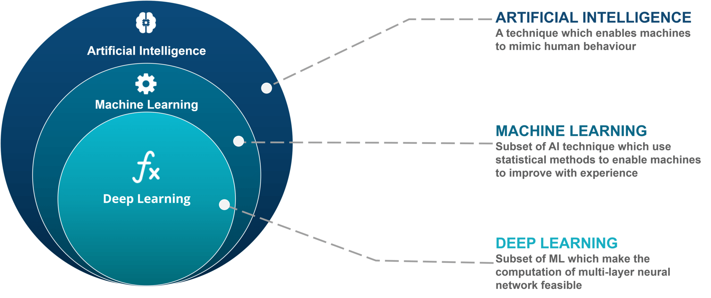
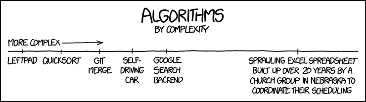
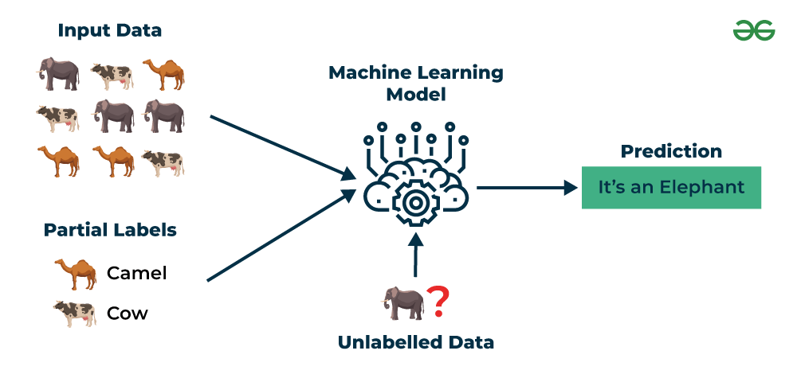

The amount of jargon one finds when digging into the machine learning (ML) literature is a common source of confusion. Many ML terms are borrowed from statistics, computer science, or everyday language, but they can carry subtly or even radically different meanings in the context of ML.

In the following overview I will provide a high-level summary of some common terms used in machine learning, and try to highlight the differences between concepts that may seem familiar to you, but can represent distinct ideas.

::: {style="color: yellow"}
# A Quick Review: AI, ML, and Deep Learning
:::

We mapped these terms in [From Explanation to Prediction](f02_explanation_prediction.qmd). The short version:

-   **Artificial intelligence** is the broad field of building systems that do things normally requiring human intelligence, by any means, including rules written out by hand.
-   **Machine learning** is the subset where the behavior is learned from data instead of programmed.
-   **Deep learning** is machine learning built on neural networks with many layers.

One test sorts most cases: was the behavior programmed by a person, or learned from data? A thermostat follows a written rule. A spam filter learned its rules from millions of emails.

::: {style="color: yellow"}
# Algorithms and Models
:::

The rest of this page is about a different distinction, one that causes more confusion than the first:

-   An **algorithm** is the procedure that does the learning.
-   A **model** is what that procedure produces.

People use the two words interchangeably in casual conversation. Keeping them separate will make the next ten weeks much easier to follow.

:::  {style="color: yellow"}
# What is an Algorithm in ML?
:::

ML approaches rely heavily on accurate and efficient prediction algorithms.

So, what exactly are algorithms?

An algorithm is a step-by-step, well-defined procedure for solving a problem or completing a task.

In computing and machine learning, algorithms are generally a finite sequence of instructions that takes some input, follows a set of rules, and produces an output.

::: {style="color: lightblue"}
## Characteristics of an Algorithm
:::

1.  **Input**: the data the algorithm operates on
2.  **Output**: the result produced after execution
3.  **Finiteness**: it must finish in a finite number of steps
4.  **Definiteness**: each step is clear and unambiguous
5.  **Effectiveness**: each operation can actually be carried out

::: {style="color: lightblue"}
## Algorithms in Machine Learning
:::

-   In ML, an algorithm is the procedure used to train a model from data.

-   Example: Linear regression algorithm finds the best-fit line by minimizing error.

-   Example: Decision tree algorithm splits data into branches by checking features step by step.

One can think of an algorithm as the recipe one follows when cooking a meal. The ingredients of the dish are analogous to the input data, and the finished dish is equivalent to the model.

So, how does an algorithm differ from a model? What is a model in the context of ML?

::: {style="color: yellow"}
# What is a Model in ML?
:::

A model in machine learning is the learned representation of patterns in data, produced by applying a learning algorithm to a dataset.

A model in ML is the vehicle to make predictions, classify new examples, or infer relationships.

::: {style="color: lightblue"}
## Definition
:::

A model is the outcome of training a machine learning algorithm on data. It encapsulates the patterns, relationships, or structure discovered in the training data.

-   **Input:** Features from the training data\
-   **Process:** Algorithm (e.g., linear regression, decision tree, neural network)\
-   **Output:** Parameters, structure, or rules that allow prediction

::: {style="color: lightblue"}
## Examples
:::

| Algorithm | Resulting Model | What It Represents |
|-------------------|--------------------|---------------------------------|
| Linear Regression | A line (y = mx + b) | Relationship between input and output variables |
| Decision Tree | Tree of splits | How features split to predict classes or values |
| Neural Network | Layers of neurons & weights | Complex non-linear mappings between inputs and outputs |
| k-Means Clustering | Cluster centroids | Grouping of data points into clusters |

------------------------------------------------------------------------

::: {style="color: lightblue"}
## Things to Remember
:::

-   The algorithm is the procedure for learning\
-   The model is the trained artifact used for prediction or inference
-   Different algorithms can produce different models from the same data
-   A model generalizes patterns from training data to unseen data
-   Algorithm = recipe (instructions for learning)
-   Model = finished dish (learned representation ready to use)

The model is the end product of learning. It is the part that actually knows something about the data and can be used to make predictions.

In machine learning: Data + Algorithm → Model → Predictions.

::: {style="color: yellow"}
# Choosing the Right Algorithm
:::

Choosing an algorithm for a new problem is genuinely hard, and we will spend much of this course on how to make and defend that choice.

The difficulty is not a gap in your training. It is a real result, known as the **no free lunch theorem**:

-   No single algorithm performs best across all possible problems.
-   An algorithm that wins on one kind of data will lose on another.
-   Averaged over every possible problem, all algorithms perform the same.

Three consequences follow, and they shape the whole semester:

-   You cannot know in advance which method will win on your data.
-   You therefore have to try several and compare them honestly.
-   Comparing them honestly requires held out data, which is why data splitting comes next.

This is also why the course is organized as a tour of many methods rather than a defense of one favorite.

::: {style="color: yellow"}
# Design Your Own Algorithm
:::

An algorithm is a set of ordered instructions for solving a problem. Machine learning algorithms are no different. They are systematic ways of finding patterns in data.

::: {.callout-tip icon="false"}
## Design Your Own Algorithm

In groups of 3 or 4 (about 10 minutes). Suppose you have access to a person's **screenome** in real time, the moment by moment record of everything on their screen that we looked at in the first lecture.

How would you design an algorithm that decides whether that person is stressed?

Work through these questions in order:

1.  **What features would you use?** Think about what a screenome actually records: which apps are open, how often the person switches between them, how long each session lasts, what time of day it is, and what they are typing.
2.  **What rules or steps would you design?** Be specific enough that someone could follow them without asking you questions.
3.  **How would you know whether your algorithm was right?** Where would the correct answers come from?
4.  **How would the algorithm improve if you had this data from many people?**

Each group shares one feature they would use and the hardest problem they ran into.
:::
