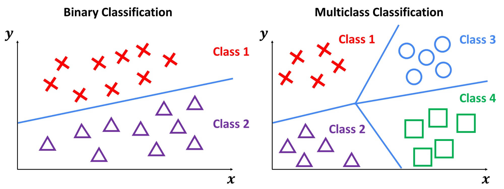
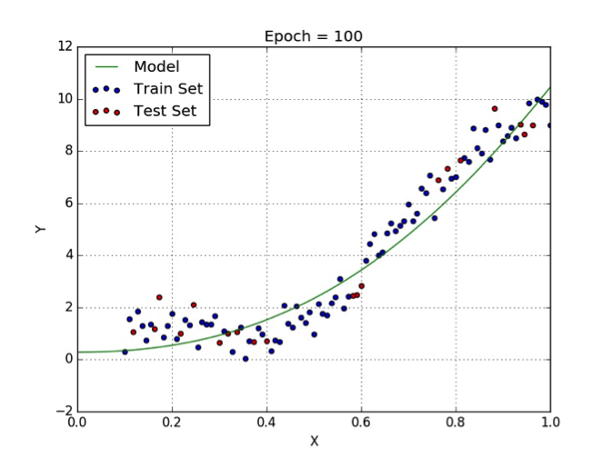
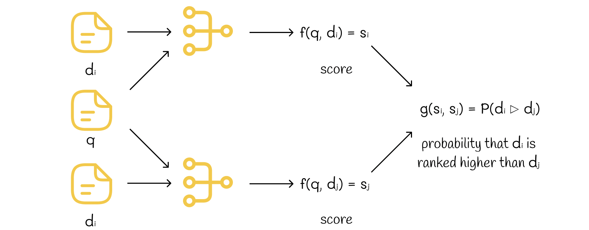
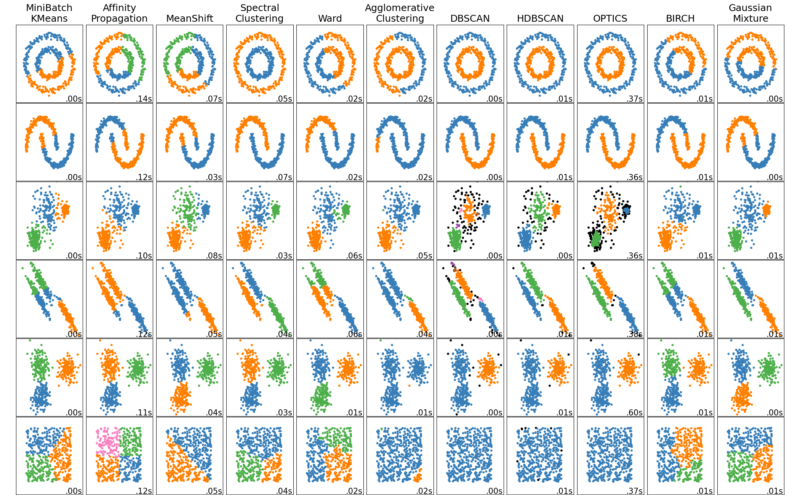
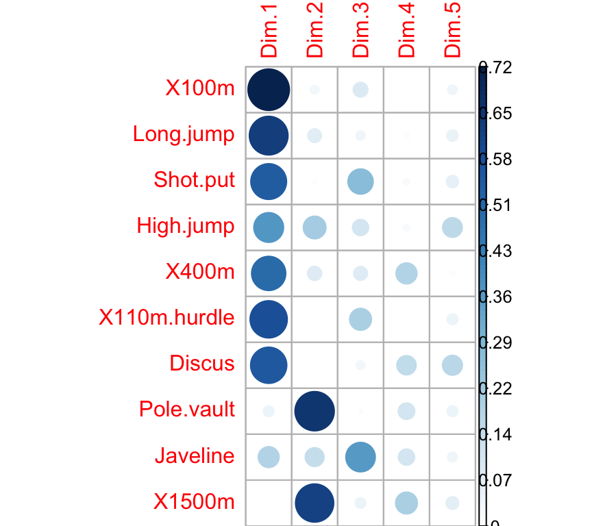

::: {style="color: yellow"}
# Two Flavors of Machine Learning
:::

Before listing specific problems, it helps to know that they divide into two families. The dividing question is simple: **is there an outcome the model is trying to get right?**

::: {style="color: lightblue"}
## Supervised Learning
:::

**The data include a target**, and the target supervises the learning.

-   You have the right answers for the cases you train on.
-   Success is measurable: compare predictions against known values.
-   Covered in Module 2 of this course.

::: {style="color: lightblue"}
## Unsupervised Learning
:::

**There is no target.**

-   You are describing structure rather than predicting an outcome.
-   Success is harder to judge, because there is no answer key.
-   Covered in Module 3 of this course.

::: {style="color: lightblue"}
## Select Examples
:::

The five problem classes below sort into those two families:

| Problem class | Family | Course module |
|----|----|----|
| Classification | Supervised | Module 2 |
| Regression | Supervised | Module 2 |
| Ranking | Supervised | Module 2 |
| Clustering | Unsupervised | Module 3 |
| Dimension reduction | Unsupervised | Module 3 |

::: {style="color: yellow"}
# Major Classes of Machine Learning Problems
:::

Machine learning applications correspond to a wide variety of learning problems. Some major classes include:

## Classification

-   The *goal of classification* is often to assign a category or label to each observation.
-   The music genre problem is a good example of a classification problem
-   **Note:** The number of categories can be small, large, or even unbounded (e.g., optical character recognition, text classification, speech recognition).

{fig-align="center" width="700"}

::: {.callout-tip icon="false"}
## Quick Question
Where have you run into a classifier today? Think about your email, your phone, and anything that sorted something into a category for you.
:::

------------------------------------------------------------------------

## Regression

-   In regression problems we are typically concerned with predicting a real-valued number for each item.

-   For example, we might be interested in predicting stock prices, or how stressed out someone is.

-   **Notes:** The penalty for prediction errors depends on the magnitude of the difference between true and predicted values, unlike classification where categories are discrete and there is often no notion of distance between various categories.

    {fig-align="center" width="700"}

::: {.callout-tip icon="false"}
## Quick Question

Where have you seen a number predicted rather than a category? Delivery time estimates and price forecasts are a good place to start.
:::

------------------------------------------------------------------------

## Ranking

-   With ranking problems we are often tasked with ordering items according to a specific criterion.
-   A well-known example of a ranking algorithm is Google's [PageRank](https://web.stanford.edu/class/cs54n/handouts/24-GooglePageRankAlgorithm.pdf) algorithm.
-   **Notes:** Ranking problems focus on relative order rather than exact category or numeric value.

{fig-align="center" width="700"}

::: {.callout-tip icon="false"}
## Quick Question

What gets ranked for you on a typical day, and what do you think the ranking is optimizing for?
:::

------------------------------------------------------------------------

## Clustering

-   In clustering problems we are typically looking to partition items into similar groups or regions.
-   For example, in social network analysis we are interested in identifying communities within large groups of people
-   **Notes:** Clustering is often applied to very large datasets to reveal underlying structure.

{fig-align="center" width="700"}

::: {.callout-tip icon="false"}
## Quick Question

Two questions here:

-   How does clustering differ from classification? 
-   Where might clustering be running on data about you?
:::

------------------------------------------------------------------------

## Dimensionality Reduction

-   When looking to solve dimension reduction problems we are typically interested in transforming high-dimensional data into a lower-dimensional representation while preserving important properties.
-   Common examples in psychology include identifying constructs in survey data or scales.
-   **Notes:** Dimension reduction is also useful for feature extraction, noise reduction, and speeding up downstream learning tasks.

{fig-align="center" width="700"}

::: {.callout-tip icon="false"}
## Quick Question

Psychology does dimension reduction constantly. If you have ever taken a personality inventory and received five scores from fifty questions, you have seen it. Where else?
:::

::: {style="color: yellow"}
# Looking Forward
:::

The rest of the course works through these five problem classes:

-   **Classification and regression** take up Module 2, starting with linear and logistic regression and building toward trees, ensembles, and deep learning.
-   **Clustering and dimension reduction** take up Module 3.
-   **Ranking** we will mention rather than cover, since it appears less often in psychological research.

Two things have to come first, and both arrive next week:

-   **Data splitting**, because comparing methods honestly requires data the model has not seen.
-   **Bias and variance**, because they explain why the comparison usually has a sweet spot rather than a winner.
