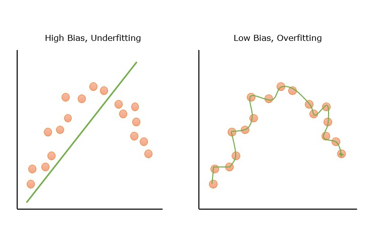
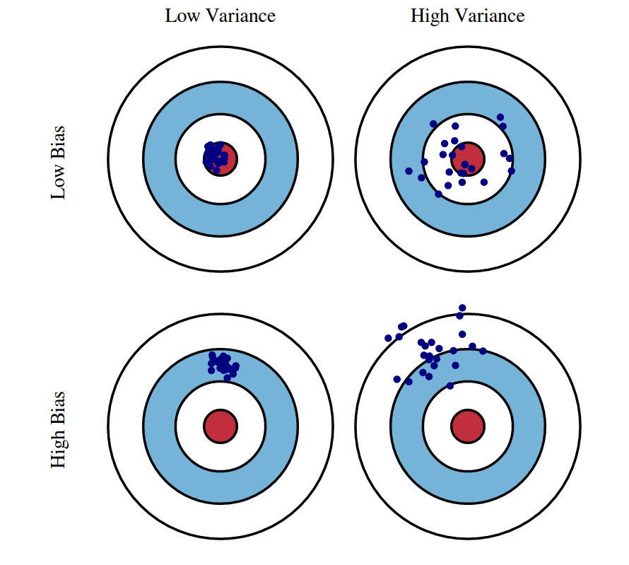

Prediction errors can be broken down into two main parts: bias and variance.

-  These represent different sources of mistakes a model can make.

-  **Usually, there is a tradeoff between keeping bias low and keeping variance low.** 

-  It can be exceptionally hard to minimize both at the same time.

By understanding where bias and variance come from, we can make better choices when building models and end up with more accurate predictions.

::: {style="color: yellow"}
# Bias in Machine Learning
:::

The word **bias** carries two different meanings in ML

-  **Social oralgorithmic bias**: A model exhibits social bias when its data, design, or use systematically advantages or disadvantages particular groups.
-  **Statistical bias**: A model is statistically biased when its predictions systematically deviate from the true relationship or target it is trying to estimate.

::: {style="color: lightblue"}
## Social or Algorithmic Bias
:::

First, we will talk about social or algorithmic bias, which is a type of bias that can arise in machine learning models due to the data they are trained on or the way they are designed.

:::  {style="color: lightyellow"}
### Common Source of Bias in Machine Learning
:::

-   **Data-related bias**: This occurs when the training data itself is not representative of the real-world scenario or contains skewed or prejudiced information. Data-related bias often result from incomplete datasets.

    -   Example: facial recognition systems trained on light-skinned faces

-   **Algorithmic bias**: This type of bias arises from the model's architecture or the assumptions embedded within the algorithms. Algorithmic bias can often reflect societal inequities.

    -   Example: hiring

:::  {style="color: lightyellow"}
### Some Consequences of Bias in Machine Learning
:::

-   **Inaccurate Predictions**: Biased models do not properly capture the true data generating pattern.

-   **Unfair or Discriminatory Outcomes**: Unfair treatment of individuals based on demographic characteristics.

-   **Reinforcement of Stereotypes**: Biased AI systems can perpetuate and even amplify existing societal stereotypes.

::: {.callout-tip icon="false"}
## Where Could the Bias Come From?

In groups of 3 or 4 (about 8 minutes).

A university builds a machine learning model to predict which applicants are likely to succeed academically. The model is trained on data from students **admitted** over the previous 10 years, using high school GPA, test scores, ZIP code, extracurricular activities, and whether the student graduated.

Discuss three questions:

1.  Where could bias enter this system?
2.  Which variables might indirectly capture sensitive characteristics, and what problems could that create?
3.  Could the model be very accurate and still be unfair? Why?

:::

::: {style="color: lightblue"}
## Statistical Bias
:::

**Statistical bias** is the difference between the average prediction from our model and the true value which we are trying to predict.

In this sense, bias often refers to the systematic error in a model.

A biased model fails to accurately reflect the true relationship in the data, leading to poor generalization and skewed predictions.

{width="800"}

::: {style="color: yellow"}
## Variance in Machine Learning
:::

In statistics, variance is a measure of dispersion, meaning it is a measure of how far a set of numbers is spread out from their average value.

In machine learning, variance typically refers to the sensitivity of a model's predictions to small changes in the training data.

So, error due to *variance* is defined as the variability of a model prediction for a given data point.

:::  {style="color: lightblue"}
### Common Causes of High Variance
:::

-   **Model complexity**: Overly complex models, with many features or high-degree terms, are more prone to high variance compared to simpler models.

-   **Insufficient data**: With smaller datasets, observation specific fluctuations matter more, so predictions on new data become less stable with higher variance.

::: {style="color: yellow"}
## The Bias Variance Tradeoff
:::

Bias and variance are often introduced together in the context of the bias-variance tradeoff that occurs when models overfit, or underfit, the data.

When a model *overfits the data*, it means the model has learned too much from the training data, including random noise or minor fluctuations, rather than just the true underlying patterns.

When a model *underfits the data*, it means the model is too simple to capture the underlying patterns in the data.

{width="800"}

:::  {style="color: lightblue"}
### Why a Bias-Variance Tradeoff?
:::

The bias-variance tradeoff can be understood as the tension between model simplicity and model flexibility: improving one can often worsen the other.

-   **Underfitting and High Bias:**
    -   Model is too simple to capture the true patterns in the data.
    -   Both training and test errors are high, and close to each other.
    -   Variance is low because predictions do not change much when trained on different datasets.
-   **High Variance (Overfitting):**
    -   Model is too flexible and fits the training data, including its noise, very closely.
    -   Training error is low, but test error is high. The **gap** between them is the tell, not the level of either one.

::: {.callout-tip icon="false"}
## Quick Check

1.  A model scores 95 percent on training data and 60 percent on test data. Bias or variance?
2.  A model scores 62 percent on training data and 60 percent on test data. Bias or variance?
:::

:::  {style="color: lightblue"}
### Why the Tradeoff Occurs
:::

-   Making the model more complex reduces bias but increases variance, since the model becomes sensitive to small fluctuations in the training data.
-   Making the model simpler reduces variance but increases bias, because it cannot capture all the patterns.

There is a sweet spot in between that balances bias and variance, resulting in the lowest total prediction error.

{width="800"}

:::  {style="color: lightblue"}
### High Bias and High Variance?
:::

This can happen if the model is poorly specified and trained on very noisy or limited data:

-   It cannot represent the underlying patterns properly (high bias)

-   Predictions fluctuate a lot due to the noise (high variance).

:::  {style="color: lightblue"}
### Double Descent
:::

## Double Descent

**Double descent** occurs when test error decreases, then increases, and then decreases again as model complexity grows.

In the classical bias–variance tradeoff, very complex models tend to overfit and have high variance.

With double descent, the worst performance often occurs near the **interpolation point**, where the model is just flexible enough to fit the training data perfectly.

### Intuition

A model with *just enough* flexibility may have to fit the training data in an unstable way.

But a model with **far more flexibility** has many possible ways to fit the data, allowing the learning algorithm to find a smoother or more stable solution.

> More complexity can sometimes reduce variance again once the model is highly overparameterized. 
