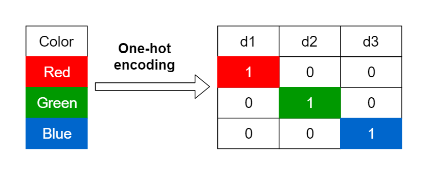
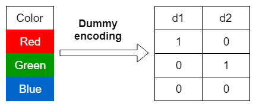

::: {style="color: yellow"}
## Setup
:::

To follow along, load these packages and the dataset we assembled on the [Example Data](week2_5b.qmd) page. If you did not build it yourself, you can [download `data.RDS`](data/data.RDS) and save it in a `data` folder next to your script.

```{r}
library(dplyr)       # data manipulation and the pipe
library(tidymodels)  # the recipes package, used for every step below

data <- readRDS("data/data.RDS")
```

Many models require that the predictors take numeric form. There are exceptionssuch as tree-based models, however, even tree-based methods can benefit from preprocessing categorical features. The following sections will discuss a few of the more common approaches to engineer categorical features.

::: {style="color: orange"}
### Lumping
:::

Sometimes features will contain levels that have very few observations. For example, take a look at the work status variable `wrkstat`. There are 8 unique levels and some have relatively few observations. For example, `With A Job, But Not At Work Because Of Temporary Illness, Vacation, Strike`.

```{r}
# count() tallies how many rows fall into each level of wrkstat and puts the
# tally in a column called n. arrange(n) then sorts by that column, smallest
# first, which brings the rare levels we care about to the top.
count(data, wrkstat) %>% arrange(n)
```

Sometimes we can benefit from collapsing, or “lumping” these into a lesser number of categories. In the above examples, we may want to collapse all levels that are observed in less than 5% of the training sample into an `Other` category. We can use `step_other()` to do so.

```{r}
# Write the recipe. step_other() does the lumping.
#   wrkstat          the column to lump, though you can name several
#   threshold = 0.05 any level holding less than 5 percent of the rows
#                    gets collapsed
#   other = "Other"  what to call the new combined level
lumping <- recipe(happy ~ ., data = data) %>%
  step_other(wrkstat, threshold = 0.05,
             other = "Other")

# prep() works out which levels actually fall below the threshold, and bake()
# applies that decision and hands back the changed data. You will see this
# pair again in the Workflow section at the end of the unit.
apply_2_training <- prep(lumping, training = data) %>%
  bake(data)

# Count wrkstat again and compare against the table above. The rare levels
# have been folded into a single Other category.
count(apply_2_training, wrkstat) %>% arrange(n)
```

::: {style="color: orange"}
### One-Hot and Dummy Encoding
:::

As mentioned previously many models require that all features be numeric. Consequently, we need to intelligently transform any categorical variables into numeric representations so that these algorithms will work.

There are many ways to recode categorical variables as numeric (e.g., one-hot, ordinal, binary, sum, and Helmert).

One-hot encoding is a common method for converting categorical variables into a numerical format that machine learning algorithms can work with. Instead of assigning arbitrary numbers to categories (which could incorrectly imply an order), one-hot encoding creates a new binary (0/1) column for each category level. For a given observation, the column corresponding to its category is set to 1, and all others are set to 0.

{width="800"}

However, this creates perfect collinearity which causes problems with some predictive modeling algorithms (e.g., ordinary linear regression and neural networks). Alternatively, we can create a full-rank encoding by dropping one of the levels (level `blue` has been dropped). This is referred to as dummy coding.

{width="800"}

Below is an example of one-hot encoding the predictors in our model.

```{r}
# step_dummy() turns categorical columns into numeric indicator columns.
#   all_factor_predictors() selects every categorical predictor at once, so
#                           you do not have to name them
#   one_hot = TRUE          make one column per level, as in the first image
#   one_hot = FALSE         drop one level to act as the reference category,
#                           which is the dummy coding in the second image and
#                           what regression models normally want
recipe(happy ~ ., data = data) %>%
  step_dummy(all_factor_predictors(), one_hot = TRUE)
```

Printing the recipe only shows the plan. It tells you a dummy step exists, but not how many columns it will create, because that is not known until the recipe is prepped and it sees how many levels each variable has.
