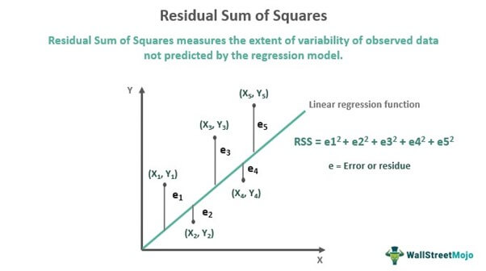

[Simple Linear Regression](week3_1.qmd) treated regression as a prediction algorithm and deliberately set the statistics aside. This page picks them back up.

The distinction worth holding onto is that these two views answer different questions.

-   **Prediction** asks how close the model's guesses are for students it has never seen. It is judged on held out data.
-   **Inference** asks how precisely a coefficient has been estimated, and whether we can rule out that it is really zero. It is judged using the sampling distribution of the estimate.

A coefficient can be overwhelmingly significant and contribute almost nothing to prediction. That happens routinely with large samples, where tiny effects clear the significance bar easily. Neither view, on its own, tells you that changing a predictor would cause the outcome to change.

::: {style="color: yellow"}
## Setup
:::

We use the same model as the previous page.

```{r}
library(dplyr)

dropout <- read.csv("data/dropout.csv", sep = ";") %>%
  rename(
    grade_sem1      = Curricular.units.1st.sem..grade.,
    grade_sem2      = Curricular.units.2nd.sem..grade.,
    admission_grade = Admission.grade
  )

# Students who completed units in both semesters, as before
completers <- dropout %>% filter(grade_sem1 > 0, grade_sem2 > 0)

fit <- lm(grade_sem2 ~ grade_sem1, data = completers)
```

::: {style="color: yellow"}
## The Model Being Estimated
:::

The prediction page wrote the fitted equation. The statistical model behind it is:

$$
Y_i = \beta_0 + \beta_1 X_i + \varepsilon_i, \quad \quad \text{for}\:i=1,2,\dots,n
$$

where:

-   $Y_i$ is the ith observation on the target variable.
-   $X_i$ is the ith observation of the feature.
-   $\beta_0$ is the intercept, the expected value of $Y$ when $X=0$.
-   $\beta_1$ is the slope, how much $Y$ changes for a one unit increase in $X$.
-   $\varepsilon_i$ is the error term, capturing variation not explained by $X$.

Note the Greek letters. $\beta_0$ and $\beta_1$ are the **unknown true values** in the population. What we compute from a sample are estimates, written $b_0$ and $b_1$ or $\hat\beta_0$ and $\hat\beta_1$. Inference is the business of saying how far those estimates might be from the truth.

We estimate them by minimizing the residual sum of squares, which is the same criterion the prediction page described as a loss function.

{width="1000"}

::: {style="color: yellow"}
## Accuracy of the Least Squares Estimates
:::

How accurate are the least squares estimates of $\beta_0$ and $\beta_1$?

Point estimates by themselves are not very informative. It is often desirable to associate an estimate with some measure of its variability.

```{r}
summary(fit)
```

That output is the whole inference toolkit in one table. The rest of this page is an explanation of its columns.

::: {style="color: lightblue"}
### Standard Errors
:::

The variability of an estimate is typically measured by its **standard error (SE)**, which is the square root of its variance.

If we assume the errors are i.i.d. $\sim (0, \sigma^2)$, then simple expressions for the SEs of the estimated coefficients exist. These are displayed in the **`Std. Error`** column above.

Read a standard error as: if we drew a new sample of students the same way, this is roughly how much the estimated coefficient would bounce around.

::: {style="color: lightblue"}
### t Tests for Coefficients
:::

From these SEs, we can derive t tests for whether individual coefficients differ from zero.

$$
t = \frac{\hat{\beta}_j}{SE(\hat{\beta}_j)}
$$

In the `summary()` output this is the **`t value`** column.

-   The t statistic measures how many standard errors the coefficient sits away from zero.
-   Absolute values above roughly 2 suggest significance at $\alpha = 0.05$.
-   The corresponding p values are in the **`Pr(>|t|)`** column.

::: {.callout-warning icon="false"}
## Significance Is Not Predictive Usefulness

With 3,512 students, a coefficient can be significant at any conventional threshold while moving predictions by a negligible amount. Sample size drives significance. It does not drive usefulness.

On the previous page we added `admission_grade` and `scholarship` to the model. Both are significant. Test set RMSE barely moved.

If you want to know whether a predictor helps you predict, the p value is not the tool. Held out error is.
:::

::: {style="color: lightblue"}
### Confidence Intervals for Coefficients
:::

Under the same assumptions we can construct confidence intervals. The traditional $100(1-\alpha)\%$ interval for $\beta_j$ is:

$$
\hat{\beta}_j \pm t_{1-\alpha/2, \, n-p} \cdot SE(\hat{\beta}_j)
$$

```{r}
confint(fit, level = 0.95)
```

In general, a 95% confidence interval for a parameter means:

> If we were to repeat the study many times (same design, new random samples each time), and for each sample we computed a 95% CI, then 95% of those intervals would contain the true parameter value.

Note what that sentence does **not** say. It is not a statement that there is a 95% probability the true value lies in this particular interval. The randomness is in the procedure across repeated samples, not in the parameter.

::: {style="color: yellow"}
## The Error Term
:::

In the model

$$
Y_i = \beta_0 + \beta_1 X + \varepsilon_i
$$

the error term $\varepsilon$ is at the heart of the model.

-   It represents the part of $Y$ that the model cannot explain with $X$.
-   It captures **random noise**, measurement error, and the influence of variables not included in the model.
-   Without $\varepsilon$, the regression line would perfectly fit every data point, which almost never happens in real data.

::: {style="color: lightblue"}
### Assumptions About the Error Term
:::

Classical linear regression (the Gauss and Markov framework) makes several key assumptions about $\varepsilon$:

-   $E[\varepsilon] = 0$: on average, the errors cancel out, so there is no systematic bias.
-   $\text{Var}(\varepsilon) = \sigma^2$: the variance of errors is constant across all values of $X$ (**homoscedasticity**).
-   Errors are independent of each other.
-   Errors are uncorrelated with the predictor $X$.

These assumptions are what license the standard errors, t tests, and confidence intervals above. They are **not** required for the model to produce useful predictions. A model can violate them and still predict well, and it can satisfy them and predict badly.

You can inspect them visually:

```{r}
par(mfrow = c(2, 2))
plot(fit)
par(mfrow = c(1, 1))
```

The first panel checks whether residuals have systematic structure left in them, and the second checks whether they are roughly normal.

::: {style="color: lightblue"}
### The Variance of the Error Term ($\sigma^2$)
:::

-   $\sigma^2$ measures how much the actual values of $Y$ scatter around the regression line.
-   A smaller $\sigma^2$ means points cluster tightly around the line, so the fit is better.
-   A larger $\sigma^2$ means more unexplained variability and less precise predictions.

In practice $\sigma^2$ is unknown, so we estimate it with the **residual variance**:

$$
s^2 = \frac{\sum_{i=1}^n (y_i - \hat{y}_i)^2}{n - 2}
$$

where $y_i$ is the observed outcome, $\hat{y}_i$ the predicted outcome, $n$ the sample size, and the denominator $n-2$ accounts for the two estimated parameters.

```{r}
# R reports the square root of this as "Residual standard error"
sigma(fit)

# The same thing computed directly
sqrt(sum(residuals(fit)^2) / (nrow(completers) - 2))
```

::: {.callout-note icon="false"}
## How This Connects Back

The residual standard error above is close to the test set RMSE from the prediction page, and that is not a coincidence. Both are summarizing the size of a typical residual.

The difference is which residuals. $\sigma$ is estimated from the residuals of the data the model was fit to. Test RMSE uses residuals from data the model never saw. When a model is honest and the sample is large, the two land in a similar place. When a model has been overfit, the first stays small while the second grows, which is exactly the gap the noise predictor demonstration on the previous page opened up.
:::

Back to [Simple Linear Regression](week3_1.qmd), or on to [Multiple Linear Regression](week3_2.qmd).
