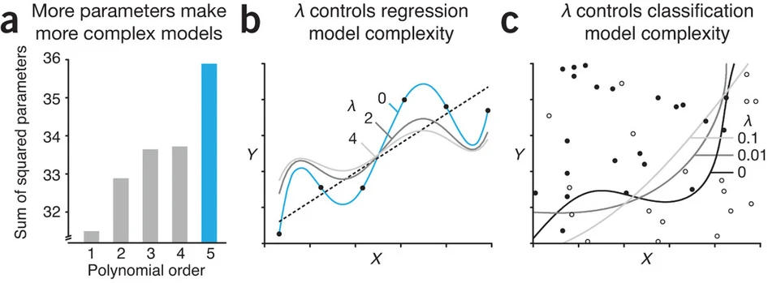

:::: {.slide}
::: {style="color: yellow"}
## Today's Lecture
:::
In today's lecture we will cover:

- A Conceptual Introduction
::::

:::: {.slide}
::: {style="color: yellow"}
## What is Regularization?
:::

In the linear and logistic regression sections we estimated coefficients that fit the training data as closely as possible. 

**Regularization** is a way to make a model **simpler and less sensitive to the training data** by adding a penalty for complexity.

Instead of choosing coefficients that only minimize prediction error:

$$
\text{Loss}
$$

we minimize:

$$
\text{Loss} + \lambda \times \text{Penalty}
$$

- **$\lambda$**: controls how strongly we penalize complexity
::::


:::: {.slide}
::: {style="color: yellow"}
## Main Idea of Regularization
:::

With regularization we minimize:

$$
\text{Loss} + \lambda \times \text{Penalty}
$$



**Accept a little more bias in exchange for:** 

- Selection of important features (predictors)
- Less variance and better prediction on new data
::::

:::: {.slide}
::: {style="color: yellow"}
## Example: The MMPI Questionnaire
:::

In the 1940s psychologists were building a questionnaire to help distinguish psychiatric patients from individuals in a comparison group. 

They had hundreds of true or false items, but only wanted to keep a few. Here are eight:

-   I often feel sad.
-   I have difficulty sleeping.
-   I frequently feel that the future is hopeless.
-   I like reading about machines.
-   I enjoy mystery stories.
-   Windstorms frighten me.
-   I often feel tired.
-   I enjoy attending social gatherings.

::: {style="color: lightgreen"}
If you could keep only three, which three would you keep?
:::
::::

:::: {.slide}
::: {style="color: yellow"}
### How the MMPI Was Actually Built
:::

At the time, personality tests were built the other way around. A researcher decided what depression was, then wrote items that sounded like depression (e.g. "face validity)

Researchers working at the University of Minnesota built the **Minnesota Multiphasic Personality Inventory (MMPI)** using a different approach. 

Rather than deciding in advance which questions *should* measure a particular disorder, they used an approach known as **empirical criterion keying**.

It went roughly like this:

1. Start with a large pool of candidate items.
2. Give them to people from known groups, such as a diagnostic group and a comparison group.
3. Find the items that the groups answer differently.
4. Keep those items, whether or not their content seems obviously related to the diagnosis.

::: {style="color: lightgreen"}
Which step seems like a radical one?
:::
::::

:::: {.slide}
::: {style="color: yellow"}
### Theoretically Mysterious Items
:::

Consider the very first MMPI item:

**“I like mechanics magazines.”**

That does not sound much like a question from a psychological assessment.

Paul Meehl, explaining the logic of this approach in 1945, gave an even more striking example. The item **“I sometimes tease animals,”** when answered *false*, appeared on a scale measuring symptomatic depression. Meehl called this relationship “theoretically mysterious.” His point was that this did not make the item useless. He argued that researchers should be:

> prepared to admit powerful items to personality scales regardless of whether the rationale of their appearance can be made clear at present.
::::

:::: {.slide}
::: {style="color: yellow"}
### Windstorm Findings
:::

Meehl's own example is worth reading closely.

Fear of windstorms, for example, does not indicate psychological health. The point is narrower:

> **The empirical relationship between an item and an outcome can look nothing like what you would guess from reading the item.**

**That is one case for letting data choose predictors. This is a solid argument for every feature selection method in this course.**
::::

:::: {.slide}
::: {style="color: yellow"}
### What Meehl Said Twenty Six Years Later
:::

The story becomes more interesting as time progresses...

When the 1945 paper was reprinted in 1971, Meehl added a prefatory comment taking much of it back. He called the paper "overly dust-bowl empiricist," and explained why the scales lost accuracy when applied to new populations:

> the validity shrinkage we see in moving to new populations ... is, I am sure, partly a result of the presence of items that appeared in the criterion analysis mainly because they were correlates of unrecognized nuisance-variables. I now believe that "blind empirical keying," where we retain an item whether it makes any sense or not, is conducive to this lack of generalizability.

::: {style="color: lightgreen"}
What is Meehl describing in machine learning terms?
:::


::::

:::: {.slide}
::: {style="color: yellow"}
### Overfitting and Feature Selection
:::

Translated into the language of this course: if you search hundreds of items for whatever separates your groups, some items will separate them **by accident**. 

Those items are fitted to the particular sample that selected them, and they stop working on anybody else. 

So feature selection has two questions, not one:

-   Does this variable help us predict the outcome?
-   Does it keep helping on new data?
::::

::: {.slide}
::: {style="color: yellow"}
### Paul Meehl: One of the Best to Do It
:::
{width=240 fig-align="center"}

::: {.callout-note icon="false"}
## Aside: You Can Watch Meehl Teach

Paul Meehl spent his career at the University of Minnesota, and his 1989 *Philosophical Psychology* course was recorded. The university has posted all 12 sessions, with video, audio, and his lecture notes: <https://meehl.umn.edu/video>

Among the topics are statistical significance testing and clinical versus statistical prediction, which is the argument that a simple formula often beats expert judgment. That debate is the ancestor of much of what this course does.
:::
::::


:::: {.slide}
::: {style="color: yellow"}
### A Worse Estimate That Predicted Better
:::

In 1977 Bradley Efron and Carl Morris published [an example](https://www.scientificamerican.com/article/steins-paradox-in-statistics/) using the 1970 baseball season. They took **18 players**, recorded each one's batting average after his **first 45 at bats**, and predicted what he would hit over the rest of the season.

| Prediction rule | Total squared prediction error |
|---|---:|
| Each player's own early average | 0.086 |
| Early averages pulled toward the group average | **0.027** |

Forty five at bats is a small sample, so a hot or cold start is partly skill and partly chance, and the chance will not repeat. Pulling every estimate toward the group throws some of that chance away.

The pulled estimate is **biased on purpose**, and it still predicted better.

:::: {.slide}
::: {style="color: yellow"}
## A Final Motivation: The Bet on Sparsity
:::

Many regularization methods make a simple assumption:

> **Only a small number of predictors are truly important.**

This is called **sparsity**.

- We may start with many possible predictors.
- Most may contribute little or nothing.
- A sparse model keeps the important predictors and shrinks the rest toward zero.

For example:

$$
\beta_1 = 1.2,\qquad
\beta_2 = 0,\qquad
\beta_3 = 0,\qquad
\beta_4 = -0.8,\qquad
\beta_5 = 0
$$

### The bet

**A simpler model with only a few useful predictors may predict new data better than a model that tries to use everything.**
::::

:::: {.slide}
::: {.callout-tip icon="false"}
## Discussion Points

1.  Would you use a predictor that improves prediction when nobody can explain why it works?
2.  For prediction purposes, what are the consequences of reducing the set of predictors in a principled way?
3.  For prediction purposes, what are the benefits of reducing the set of predictors in a principled way?
:::
::::

:::: {.slide}
::: {style="color: yellow"}
## Load the Required Packages
:::

```{r}
library(glmnet)  # ridge, lasso, and elastic net
library(ggplot2) # plots
library(dplyr)   # data manipulation and the pipe
library(caret)   # train(), cross validation, and performance metrics
library(vip)     # variable importance plots
library(tidyr)   # reshaping data for the plots
```
::::

:::: {.slide}
::: {style="color: yellow"}
## A Psychological Prediction Problem
:::

Suppose we have collected data from **240 university students**. Our goal is to predict their depressive symptom scores at the end of the semester using information collected at the beginning.

Your predictors include:

-   Baseline depressive symptoms
-   Perceived stress
-   Sleep quality
-   27 additional questionnaire items and behavioral measures

There are **30 predictors in total**, and some of them overlap considerably. Several stress items are versions of the same question, and the sleep items are much the same.


```{r}
#| echo: false
set.seed(5)

n <- 240

# Three underlying tendencies that the questionnaire items share
stress_f <- rnorm(n)
sleep_f  <- rnorm(n)
mood_f   <- rnorm(n)

X <- cbind(
  baseline_symptoms = 0.7 * mood_f   + rnorm(n, sd = 0.7),
  perceived_stress  = 0.8 * stress_f + rnorm(n, sd = 0.6),
  sleep_quality     = 0.8 * sleep_f  + rnorm(n, sd = 0.6),
  # Overlapping questionnaire items, then measures unrelated to the outcome
  sapply(1:8, function(i) 0.7 * stress_f + rnorm(n, sd = 0.8)),
  sapply(1:6, function(i) 0.7 * sleep_f  + rnorm(n, sd = 0.8)),
  sapply(1:5, function(i) 0.6 * mood_f   + rnorm(n, sd = 0.9)),
  sapply(1:8, function(i) rnorm(n))
)

colnames(X) <- c("baseline_symptoms", "perceived_stress", "sleep_quality",
                 paste0("stress_item", 1:8), paste0("sleep_item", 1:6),
                 paste0("mood_item", 1:5), paste0("behavior", 1:8))

# Only a handful of predictors actually drive the outcome
beta <- rep(0, 30)
names(beta) <- colnames(X)
beta[c("baseline_symptoms", "perceived_stress", "sleep_quality")] <- c(4.5, 3.2, -2.4)
beta[c("stress_item1", "stress_item2", "mood_item1", "sleep_item1")] <- c(1.3, 1.1, 1.2, -1.0)

symptoms <- 18 + as.vector(X %*% beta) + rnorm(n, sd = 5)
```
::::

:::: {.slide}
::: {style="color: yellow"}
## Train and Test Data
:::
We divide the 240 students into two parts.

```{r}
idx <- sample(rep(c("train", "test"), times = c(120, 120)))

# One data frame for caret, which works from a formula
dat      <- data.frame(symptoms = symptoms, X)
train_df <- dat[idx == "train", ]
test_df  <- dat[idx == "test", ]

# The same split as matrices, which glmnet needs later
X_train <- X[idx == "train", ]; y_train <- symptoms[idx == "train"]
X_test  <- X[idx == "test", ];  y_test  <- symptoms[idx == "test"]
```

-   **Training (120 students)**: used to estimate coefficients, and used again, through cross validation, to choose how much regularization to apply.
-   **Test (120 students)**: untouched until the very end, used once to report performance.
::::

:::: {.slide}
::: {style="color: yellow"}
## A Baseline Model
:::

Before fitting a model with predictors, fit the one with none:

$$
\hat{y} = b_0
$$

-   It ignores every measure we collected and predicts the **same number for every student**, the training mean.
-   It cannot overfit, because there is nothing to fit.

::::

:::: {.slide}
::: {style="color: yellow"}
## Cross Validation using the Baseline
:::

`caret` calls this the null model. Performance is estimated by 10 fold cross validation inside the training data.

```{r}
ctrl <- trainControl(method = "cv", number = 10)

set.seed(5)

fit_null <- train(
  symptoms ~ .,
  data      = train_df,
  method    = "null",
  trControl = ctrl
)

round(fit_null$results[, c("RMSE", "Rsquared", "MAE")], 3)
```

::::

:::: {.slide}
::: {style="color: yellow"}
## Final Evaluation of the Baseline
:::

Let's evaluate the baseline model on the holdout test data.

```{r}
pred_null <- predict(fit_null, newdata = test_df)

# every prediction is the same number
c(prediction = unique(pred_null), training_mean = mean(train_df$symptoms))

round(postResample(pred_null, test_df$symptoms), 3)
```

Guessing 17.8 symptom points for all 120 test students misses by about **9.8 points**. 
::::

:::: {.slide}
::: {style="color: yellow"}
## Linear Regression
:::

Let's also fit the model we already know. Every one of the 30 predictor gets a coefficient:

$$
\hat{y} = b_0 + b_1 x_1 + b_2 x_2 + \dots + b_{30} x_{30}
$$

-   This is [Multiple Linear Regression](week3_2.qmd) with more predictors.
-   Ordinary least squares picks the coefficients that make the squared errors on the **training** students as small as possible.
-   Nothing in that rule keeps a coefficient from becoming large.

::::

:::: {.slide}
::: {style="color: yellow"}
## Cross Validation using Linear Regression
:::

We fit it with `caret`, the same framework used in the earlier regression pages.

```{r}
set.seed(5)

fit_lm <- train(
  symptoms ~ .,
  data      = train_df,
  method    = "lm",
  trControl = ctrl
)

round(fit_lm$results, 3)
```

Same `ctrl`, same folds, same metrics. Only the model changed.
::::

:::: {.slide}
::: {style="color: yellow"}
## Final Evaluation of Linear Regression
:::

The folds gave us an estimate. The test students give us a verdict, and we use them once.

```{r}
pred_lm <- predict(fit_lm, newdata = test_df)

rbind(
  linear   = postResample(pred_lm,   test_df$symptoms),
  baseline = postResample(pred_null, test_df$symptoms)
) |> round(3)
```

::::


:::: {.slide}
::: {style="color: yellow"}
## Revisiting Regularization
:::

Regularization changes what the model is asked to minimize.

::: {style="color: lightblue"}
**Ordinary Linear Regression**
:::

$$
\operatorname{MSE}_{\text{train}}=\frac{1}{n}\sum_{i=1}^{n}(y_i-\hat y_i)^2
$$

Choose the coefficients that make the training errors as small as possible.

Nothing else is taken into account, so a coefficient can be as large as the training data will support.

::: {style="color: lightblue"}
**Regularized Regression**
:::

$$
\text{Loss}=\operatorname{MSE}_{\text{train}}+\lambda\times\text{Penalty}
$$

Choose the coefficients that balance training error against the size of the coefficients themselves.

The first term rewards fitting the training students. The second discourages large coefficients. The parameter $\lambda$ sets how much the second term counts.
:::
::::


:::: {.slide}
::: {style="color: yellow"}
## What is this Penalty?
:::

Regularization changes what the model is asked to minimize.

$$
\text{Loss}=\operatorname{MSE}_{\text{train}}+\lambda\times\text{Penalty}
$$

The penalty is computed from the coefficients alone. It never looks at the data, it is large when coefficients are large, and $\lambda$ decides how much it counts.

::: {style="color: lightblue"}
**Lasso**, `alpha = 1`
:::
$$
\text{Penalty} = \sum_{j=1}^{p} |\beta_j|
$$
Adds up the sizes of the coefficients. Can push a coefficient to exactly zero, which drops that predictor.

::: {style="color: lightblue"}
**Ridge**, `alpha = 0`
:::
$$
\text{Penalty} = \sum_{j=1}^{p} \beta_j^2
$$
Adds up the squared coefficients. Shrinks every coefficient, but never to exactly zero.

::: {style="color: lightblue"}
**Elastic Net**, `alpha` between 0 and 1
:::
$$
\text{Penalty} = \alpha \sum_{j=1}^{p} |\beta_j| + \frac{1 - \alpha}{2} \sum_{j=1}^{p} \beta_j^2
$$
A mix of the two, which is useful when predictors are highly correlated.

::::

::::

:::: {.slide}
::: {style="color: yellow"}
## Cross Validation using Lasso
:::

Same `ctrl` and the same folds as before. Two things change: the method becomes `glmnet`, and we now have a **hyperparameter** to tune, so we hand `caret` a grid of penalties to try.

```{r}
# alpha = 1 is the lasso. lambda is the penalty strength.
lasso_grid <- expand.grid(
  alpha  = 1,  # sets estimator to lasso
  lambda = 10^seq(-3, 1, length.out = 100)
)

set.seed(5)

fit_lasso <- train(
  symptoms ~ .,
  data      = train_df,
  method    = "glmnet",
  trControl = ctrl,
  tuneGrid  = lasso_grid,
  preProc   = c("zv", "center", "scale")
)

fit_lasso$bestTune
```

-   `preProc` standardizes the predictors first, so the penalty is not an accident of measurement units.
-   `caret` fits all 100 penalties in every fold and keeps the one with the lowest cross validated RMSE.

```{r}
round(fit_lasso$results[which.min(fit_lasso$results$RMSE),
                        c("lambda", "RMSE", "Rsquared", "MAE")], 3)
```

Cross validated RMSE is 5.55 at a penalty of 0.51, against 5.87 for the linear regression with no penalty.
::::

:::: {.slide}
::: {style="color: yellow"}
## Final Evaluation of Lasso
:::

The folds gave us an estimate. The test students give us a verdict, and we use them once.

```{r}
pred_lasso <- predict(fit_lasso, newdata = test_df)

rbind(
  lasso    = postResample(pred_lasso, test_df$symptoms),
  linear   = postResample(pred_lm,    test_df$symptoms),
  baseline = postResample(pred_null,  test_df$symptoms)
) |> round(3)
```

All three scored on the same 120 students, none of which any model has seen.

-   The lasso misses by about **5.2** symptom points, the linear regression by **6.0**, and the baseline by **9.8**.
-   The lasso got there while fitting the training data **less** closely than the linear regression did.

```{r}
# how many of the 30 predictors survived the penalty
sum(coef(fit_lasso$finalModel, s = fit_lasso$bestTune$lambda)[-1] != 0)
```

::::

:::: {.slide}
::: {style="color: yellow"}
## Feature Selection of Lasso
:::

Remember, Lasso sets some of the predictor's coefficients to zero.

```{r}
# how many of the 30 predictors survived the penalty
sum(coef(fit_lasso$finalModel, s = fit_lasso$bestTune$lambda)[-1] != 0)
```

`vip()` ranks the survivors. For a penalized regression it ranks them by the size of the standardized coefficient, scaled so the largest is 100.

```{r}
#| fig-height: 4.6
# 10 predictors survived, so asking for more would only add empty bars
vip(fit_lasso, num_features = 15, aesthetics = list(fill = "orange")) +
  theme_minimal(base_size = 13)
```

-   The three predictors we would have picked by hand, baseline symptoms, sleep quality, and perceived stress, come out on top.

::::

:::: {.slide}
::: {style="color: yellow"}
## Cross Validation using Ridge
:::

Ridge is the same call with `alpha = 0`. Its penalties usually need to be larger than the lasso's, so the grid runs higher.

```{r}
ridge_grid <- expand.grid(
  alpha  = 0,  # sets estimator to ridge
  lambda = 10^seq(-2, 2, length.out = 100)  
)

set.seed(5)

fit_ridge <- train(
  symptoms ~ .,
  data      = train_df,
  method    = "glmnet",
  trControl = ctrl,
  tuneGrid  = ridge_grid,
  preProc   = c("zv", "center", "scale")
)
```

Cross validated RMSE is 5.76 at a penalty of 0.87, which beats the unpenalized 5.87 but not the lasso's 5.55.
::::

:::: {.slide}
::: {style="color: yellow"}
## Final Evaluation of Ridge
:::

```{r}
pred_ridge <- predict(fit_ridge, newdata = test_df)

rbind(
  lasso    = postResample(pred_lasso, test_df$symptoms),
  ridge    = postResample(pred_ridge, test_df$symptoms),
  linear   = postResample(pred_lm,    test_df$symptoms),
  baseline = postResample(pred_null,  test_df$symptoms)
) |> round(3)
```

```{r}
# ridge shrinks every coefficient but discards none
sum(coef(fit_ridge$finalModel, s = fit_ridge$bestTune$lambda)[-1] != 0)
```

Ridge lands between the linear model and the lasso, at **5.5** symptom points, and it keeps all 30 predictors. On data where only a few predictors matter, that is the cost of never setting one to zero.
::::

:::: {.slide}
::: {style="color: yellow"}
## Cross Validation using Elastic Net
:::

Elastic net mixes the two penalties, so `alpha` becomes a second hyperparameter to tune rather than something we fix.

```{r}
# now do ridge and lasso, or elastic net
en_grid <- expand.grid(
  alpha  = seq(0, 1, by = 0.1),
  lambda = 10^seq(-3, 1, length.out = 50)
)

set.seed(5)

fit_en <- train(
  symptoms ~ .,
  data      = train_df,
  method    = "glmnet",
  trControl = ctrl,
  tuneGrid  = en_grid,
  preProc   = c("zv", "center", "scale")
)

fit_en$bestTune
```
::::

:::: {.slide}
::: {style="color: yellow"}
## Final Evaluation of Elastic Net
:::

```{r}
pred_en <- predict(fit_en, newdata = test_df)

rbind(
  lasso       = postResample(pred_lasso, test_df$symptoms),
  elastic_net = postResample(pred_en,    test_df$symptoms),
  ridge       = postResample(pred_ridge, test_df$symptoms),
  linear      = postResample(pred_lm,    test_df$symptoms),
  baseline    = postResample(pred_null,  test_df$symptoms)
) |> round(3)
```

::::


:::: {.slide}
::: {style="color: yellow"}
## Would Lasso Always Win?
:::

No. Remember, no one approach works best on all data examples.

::: {style="color: lightgreen"}
What if all 30 predictors instead had small but real predictive effects?
:::

In that kind of problem:

- Ridge may perform better because it keeps weak signals distributed across many predictors.
- Elastic net may help when many useful predictors are also correlated.
- Which method predicts best is an empirical question that we can answer with cross validation.
::::


:::: {.slide}
::: {style="color: yellow"}
## Where the Example Left Us
:::

Five models, same 120 training students, same folds, same 120 test students:

| Model | Test RMSE | Predictors kept |
|---|---:|---:|
| Baseline, predict the mean | 9.84 | - |
| Linear regression | 6.03 | 30 |
| Ridge | 5.51 | 30 |
| Elastic net | 5.25 | 10 |
| Lasso | 5.22 | 10 |

Three things to take away:

-   **A penalty helped.** Every penalized model beat the unpenalized regression, on students none of them had seen.
-   **The best predicting model was not the best fitting one.** The lasso fit the training data worse than linear regression did and still predicted better.
-   **Dropping predictors was not the point, but it did not hurt.** Ridge kept all 30 and still improved; the lasso reached the same place with 10.
::::


:::: {.slide}
::: {style="color: yellow"}
## Loose Ends: Binary Outcome
:::

Suppose the outcome were whether a student crossed a clinical cutoff, rather than their symptom score. The penalty does not change, and neither does the grid. Four things do:

```{r}
#| eval: false
# 1. the outcome is a factor, and the level names have to be valid R names
elevated <- factor(ifelse(symptoms >= 20, "elevated", "not"),
                   levels = c("not", "elevated"))

ctrl_log <- trainControl(
  method          = "cv",
  number          = 10,
  classProbs      = TRUE,        # 2. keep the predicted probabilities
  summaryFunction = mnLogLoss    # 3. score them with log loss
)

fit_log <- train(
  elevated ~ .,
  data      = log_df,
  method    = "glmnet",          # unchanged
  family    = "binomial",        # 4. logistic rather than linear
  trControl = ctrl_log,
  tuneGrid  = lasso_grid,        # unchanged
  metric    = "logLoss",         # tune to the measure we care about
  preProc   = c("zv", "center", "scale")
)
```

> Regularization is not a separate algorithm. It is a term added to whatever loss the model already minimizes.
::::

:::: {.slide}
::: {style="color: yellow"}
## Why Standardize Before Regularization?
:::

The penalty acts directly on the size of the coefficients.

If one predictor is measured on a much larger scale than another, then a coefficient of the same size does **not** mean the same thing across predictors.

For example:

- Hours slept might range from **3 to 10**
- Income might range from **0 to 100000**

Without standardization, the penalty would treat these coefficients unevenly simply because the predictors are measured in different units.

::: {style="color: lightblue"}
**That is why we usually center and scale predictors before lasso, ridge, or elastic net.**
:::

After standardization, the penalty compares coefficients on a more equal footing.
::::


:::: {.slide}
::: {style="color: yellow"}
## Is the Intercept Penalized?
:::

Usually, **no**.

The intercept is the model's baseline prediction: the value we predict when all predictors are at zero.

Regularization is mainly concerned with the **slopes**, because those determine how complex and flexible the model is.

So in penalized regression:

- The **intercept** is typically left alone
- The **slope coefficients** are shrunk

::: {style="color: lightgreen"}
Regularization is mostly about controlling how strongly predictors influence the prediction, not about changing the overall baseline level.
:::
::::


:::: {.slide}
::: {style="color: yellow"}
## Regularization Can Work When $p > n$
:::

Ordinary least squares regression struggles when the number of predictors exceeds the number of observations.

- If **$p > n$**, there may be no unique ordinary regression solution.
- Even when a solution exists, it may be unstable and fit the training data too closely.

Regularization helps by restricting the size of the coefficients.

That means penalized regression can still be useful in settings like:

- Many questionnaire items
- Many behavioral features
- Many brain measures
- Many genes

::: {style="color: lightblue"}
**This is one reason regularization is so important in machine learning and high-dimensional data analysis.**
:::
::::


:::: {.slide}
::: {style="color: yellow"}
## Can Regularization Hurt?
:::

Yes.

If $\lambda$ is too small, the penalty is too weak and the model may still overfit.

If $\lambda$ is too large, the penalty is too strong and the model may throw away real signal.

That leads to **underfitting**:

- coefficients are shrunk too much
- predictions become too simple
- performance gets worse

::: {style="color: lightblue"}
**Regularization is not automatically good. The goal is to find the right amount.**
:::

That is why we use cross validation to choose $\lambda$.
::::